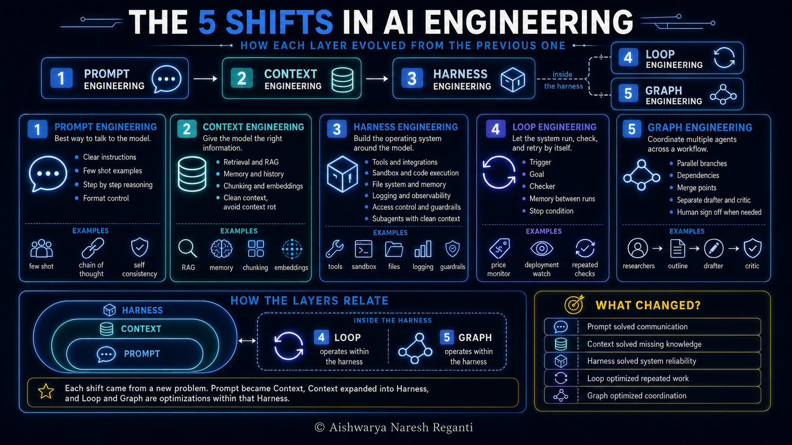

# AI Engineering Has Changed: The 5 Concepts You Need in 2026

[Watch on YouTube](https://www.youtube.com/watch?v=CoIxe4aGCpg) · 2026-08-27

<!-- cheat sheet -->

## In this video

- **Shift 1, prompt engineering**: how to talk to the model, why it became a field, and why the model companies trained the need for it away
- **Shift 2, context engineering**: limited context windows, stateless models, context rot, and the retrieval and memory work that came out of it
- **Shift 3, harness engineering**: the operating system around the model, so file systems, sandboxes, logging, access boundaries, and subagents
- **Shift 4, loop engineering**: the 5 parts of a loop, plus a live price tracking loop built in Claude Code with `/loop`
- **Shift 5, graph engineering**: a live graph in Claude Code, 3 researchers in parallel merging into an outline, a drafter, and a separate critic
- **How they connect**: which shifts solved a new problem, which are optimisations inside a harness that already exists, and 2 questions for placing the next term that shows up

## Resources

### Loop engineering, the resources mentioned in the video

- [Loop Engineering](https://addyosmani.com/blog/loop-engineering/), the essay that named it, and [Own the Outer Loop](https://addyosmani.com/blog/own-the-outer-loop/) on the difference between the agent's inner loop and the one you are running by hand
- [What is loop engineering?](https://www.ibm.com/think/topics/loop-engineering) for a shorter overview
- [Effective harnesses for long-running agents](https://www.anthropic.com/engineering/effective-harnesses-for-long-running-agents) for what changes when a loop has to survive hours instead of minutes

### Go deeper on the other shifts

- Prompt engineering: [Anthropic's prompt engineering overview](https://docs.anthropic.com/en/docs/build-with-claude/prompt-engineering/overview)
- Context engineering: [Effective context engineering for AI agents](https://www.anthropic.com/engineering/effective-context-engineering-for-ai-agents) and [Context Rot](https://research.trychroma.com/context-rot)
- Harness engineering: [The importance of agent harness in 2026](https://www.philschmid.de/agent-harness-2026) and [Harness engineering for coding agent users](https://martinfowler.com/articles/harness-engineering.html)
- Graph engineering: [Coordination as an architectural layer for LLM-based multi-agent systems](https://arxiv.org/pdf/2605.03310)

### The prompts from the video

- The price tracking loop and the article research graph are both in the transcript below, in full, ready to copy.

### LevelUp Labs

- [The AI Builder's Handbook](https://maven.com/aishwarya-kiriti/o/d4b008), free
- [LevelUp Labs](https://levelup-labs.ai/)
- [The Nuanced Perspective (newsletter)](https://thenuancedperspective.substack.com)
- [LevelUp Labs education](https://levelup-labs.ai/education)
- [Awesome Generative AI Guide](https://github.com/aishwaryanr/awesome-generative-ai-guide)
- [My courses on Maven](https://maven.com/aishwarya-kiriti)

## Sources

- Bloomberg, *"AI 'Prompt Engineer' Jobs Pay Up to $335,000"*, 29 March 2023, for the salaries in the news and the hiring wave around prompting. [bloomberg.com](https://www.bloomberg.com/news/articles/2023-03-29/ai-chatgpt-related-prompt-engineer-jobs-pay-up-to-335-000)
- Wei et al., *"Chain-of-Thought Prompting Elicits Reasoning in Large Language Models"*, 2022. [arxiv.org](https://arxiv.org/abs/2201.11903)
- Yao et al., *"ReAct: Synergizing Reasoning and Acting in Language Models"*, 2022. [arxiv.org](https://arxiv.org/abs/2210.03629)
- Wang et al., *"Self-Consistency Improves Chain of Thought Reasoning in Language Models"*, 2022. [arxiv.org](https://arxiv.org/abs/2203.11171)
- Brown et al., *"Language Models are Few-Shot Learners"*, 2020, for few-shot prompting. [arxiv.org](https://arxiv.org/abs/2005.14165)
- Chroma, *"Context Rot: How Increasing Input Tokens Impacts LLM Performance"*, July 2025, for the finding that models do not use their context uniformly and get less reliable as input grows. [research.trychroma.com](https://research.trychroma.com/context-rot)
- Peter Steinberger, 18 July 2026, the post that put the term graph engineering into circulation: *"Are we still talking loops or did we shift to graphs yet?"* [x.com](https://x.com/steipete/status/2078277297791189132)

## Transcript

_Auto-generated captions from YouTube, lightly cleaned._

The most important skill for AI engineering has shifted about five times just in the past few years. All the way from prompt engineering back in 2023 to graph engineering that was coined just a few months ago. If you're a beginner in the space and you've been wondering what all of these terms are and why everything keeps changing so quickly, then this is the only video you need to understand all of these concepts and also in a very non-overwhelming and jargon-free way. The problem with most online content out there is that they treat each of these concepts as disconnected and unrelated. But in reality, they're all connected to each other and each one was literally born from the previous one.

So in this video, we'll break down what each of these terms means, why they matter, and we'll also look at real examples for each of these concepts. So here's everything we'll cover. You can take a screenshot and keep it or the HD version is also available on my GitHub repository that's linked in the description. If you're new to this channel, I'm Aishwarya Reganti. I've been an AI researcher for more than a decade now and I have patents and publications in some of the top AI conferences.

Until last year, I was an AI scientist and tech lead at AWS and I was building production systems for large enterprises and now I run my own startup called LevelUp Labs and we help mid-market and enterprise companies go AI native. So, let's get started.

### Shift 1, prompt engineering

So the very first shift in AI engineering is prompt engineering, right? We've all heard of it. And it dates pretty much back to the ChatGPT moment when ChatGPT was released back in November of 2022. And what people found was this was suddenly a very smart chatbot. You could pretty much ask it questions in plain English, the way you would talk to humans, and it would come back with something genuinely useful.

Write me a job description for this role. Explain this contract clause. Summarize these four pages. And it absolutely required no integration, no setup and nothing to configure, right? So people all over got excited and they start to use more and more of these kind of AI models and they start noticing some patterns which is how good an answer you get from these models really depends on how well you communicate with them.

For instance, let's say you asked a math question or a logical reasoning question. You had to tell the model explicitly that it should answer step by step and not rush straight to the answer. If you wanted a specific format for your meeting summary, for instance, giving it two or three examples of your format helped the model perform much better than actually describing it in language. So users started finding out a bunch of these tips and tricks for communicating with models. And turns out it became a field of its own called prompt engineering.

And not just that through 2023 and 2024 there were so many research papers exactly on this which is essentially how do you best communicate with these models. Some of the most popular ones out there you probably heard of are chain of thought, ReAct, few-shot prompting, self-consistency, and all of that. Prompt engineering was also called the hottest job of the year and the salaries were all in the news and people were actually buying and selling prompts in marketplaces. And when this kept happening, the companies building these models, think OpenAI, Anthropic, Google and all of them started to think on how they could do something about this because prompt engineering was not a feature, it was a bug in AI models. Remember the whole promise of an AI model is that you can talk to it in human language.

But if you have to learn all of these tips and tricks and this entire art of prompt engineering before you can use AI models, well, then that whole promise is gone, right? It's almost like you've rebuilt the exact wall you were trying to remove. And now there's a special language sitting between people and models. And so they said, why don't we train our models better so that they can recognize a situation themselves without doing such heavy prompt engineering? And that's pretty much what happened.

models became much smarter at understanding humans. And today when you communicate with AI models, they will understand the situation on their own and make the right decision based on the kind of question. For instance, if it's a math question, the model knows that it has to deduce the answer step by step. If the question is about something current, it realizes that it needs to go and fetch information from the web and other examples like that. So models have generally gotten much smarter rather than humans having to overly prompt them which made the whole field matter a little less because now you don't have to become a prompt engineer.

You can pretty much talk how you talk to humans and models have gotten smart enough to understand you. And that's exactly when the second shift arrived. And before we go into that I want you to think of this whole thing very similar to the analogy of a car. And 2022, or the year when ChatGPT was introduced, can almost be thought as the invention of the engine. Now this engine is the AI model.

It's super powerful but with no attachments to it. And everything that happened after this is what people started bolting on to get it from an engine to a fully functional car and eventually multiple different kinds of cars that we have today. It's just a fun example for you to follow along and you can draw parallels to all shifts using this analogy.

### Shift 2, context engineering

Now moving on to the second shift, context engineering. Now it's early 2024 and a lot of companies have already started using these models for their own workflows and models themselves had gotten much smarter than before and it was easy to communicate with them. But then they started to realize that there's one problem to make these models work in real production use cases and that is pretty much the problem of context. What does that mean? Now remember that because models are trained on general web-scale information, information from the internet, they don't have specific information about customers within a company, their knowledge bases, their internal processes, their policies, pricing and all of this, right?

So in order to get them to work well, you need to connect them with all of this company specific information so that they could start doing real tasks. Now remember this is also the time when AI agents started becoming really popular which are essentially systems that don't just chat but they can also do real work end to end. For example, a very popular use case in the industry is a customer support agent that can read a support ticket, look up the customer's order, their history and draft a reply for them. Or an agent that can take a client brief, pulls out the company's rate card and puts a quote together. So during that period the whole emphasis of AI engineering became can you take an AI model give it access to your ecosystem your data which is essentially your context and get it to do real work end to end and doing that is context engineering and it's not very easy to do because of three problems that AI models come with one is that their context window is limited which means models can consume only a fixed number of words each time in a particular session so you need to make sure that you give them only the right information and two which is kind of related to that is AI models are stateless which means as soon as a session ends they forget.

So you have to make sure that any information that they require is shared with them during that session and anything that they need to remember has to be stored somewhere outside and also retrieved on demand. And three is this idea of what researchers call as context rot which is that if you give noisy information to AI models they tend to mess up quite badly and also lose track of what's happening even when the good information is sitting right inside the context. Having a lot of noisy information distracts them. So doing all this at scale was a problem and that gave rise to this entire area of context engineering and that was supposed to be the skill to have in 2024 and 2025 and a lot of new things and advances also came out of it for instance more advanced ways for RAG or retrieval augmented generation agentic memory methods of chunking embeddings building observability and evals and all of this and if you think back to the car analogy that we were using 2024 and 2025 was the time when And the engine was given wheels, a transmission, and a frame to hold it all together. And now we had a functional car, something that moves forward and could get the job done.

It's still a basic and early one, but it does go somewhere. And the engine on its own could not do any of this, which is the AI model on its own could not do any of this.

### Shift 3, harness engineering

Then comes our next shift, shift number three, which is harness engineering. And this happens a bit late into 2025 because by then a lot of companies had already context engineered AI systems and they were doing a lot of the work and there were also some agents in production which could do things end to end and a lot of the companies were trying to build AI systems that were far more complicated than before and they realized that we need a little more than just providing context or doing context engineering. For instance, if agents are doing long multi-step tasks, it needs to write that down somewhere so that it doesn't lose track of its progress somewhere halfway through. So builders started giving it access to a file system. And sometimes for agents to complete tasks, code had to be executed.

Like let's say you asked an agent to reconcile two spreadsheets which are pretty huge. And the most sensible way to do that is to write a small script and run it rather than reasoning through thousands of rows inside the context of the model. And in order to do that efficiently, it needed somewhere safe to run the code, which is a sandbox. And to understand why agents made certain decisions or to trace and audit their decisions, you need to build in logging and observability so that you could go back and look. And in order to make sure that the agent doesn't touch or write into high-stakes documents or environments, engineers also had to start building access control and boundaries for these agents.

And sometimes for very complex tasks, engineers started realizing that one agent might not be enough. So they have to build in subagents that can parallelize the task. Each of them could get their own clean context, do their bit and hand it back to the main agent. And through all of this, companies started realizing that in order to build a production worthy AI system, it's not just context. You need a lot more almost like an operating system where the AI agent can function.

Everything apart from the model or the whole operating system that you build around it was called a harness. And building that really well so that it works at scale is called harness engineering. And people started defining an agent as a model plus the harness around it. Now the harness can include context. It can include everything that we discussed before.

But everything that's not the model was called the harness or the term that we've been using the operating system. So context engineering didn't really go away. it got absorbed into the larger discipline of harness engineering and learning how to build a good harness became the most important skill in AI engineering. So going back to our car analogy that we've been using, harness engineering is almost like building a good quality dashboard, steering so that you can monitor information, see your speed and introducing things like seat belts, crumple zones, mirrors, lights and all of that, right? So that your vehicle is just not functional but also comes with the entire operating system.

And now the next two shifts came into picture which are loop engineering and graph engineering. Now remember that these two shifts are not really fundamental change in technology but it's almost like optimization methods that people started using within the harness itself because once you have the operating system you can start playing around with it and improving the way you work with a harness.

### Shift 4, loop engineering

So let's start with loop engineering. Right now the whole idea of loop engineering was pretty simple. Up until this point, you're still the one who's starting everything within an agent. And when I say you, it's pretty much the user. So you decide when it runs, you look at what it came back with, and then you decide what happens next.

And the whole idea around loop engineering was that can we remove humans out of the picture and set up agents in such a way that they can complete work on their own end to end. And while people make this sound more complex than it is, a loop is essentially five things. One is a trigger, which is whatever starts it. It can be a schedule or an event. m.

every day or triggers like that. A specific goal that it can check by itself so that it actually knows when a task has been finished. It can optionally also have an eval or a checker that can check if the work is being done independently and somewhere to keep notes between runs because it can forget otherwise. And finally, a stop condition with a limit so that when an agent cannot finish some work, it doesn't keep running all night. And you can literally set up a loop on agents like Claude Code or Codex just by talking with them.

Let's do a quick example. Now, say for example, you had a pair of sneakers on Amazon that you've had your eye for for months now. Now, they're probably sitting at $250 and your budget is just $200. So, you want to keep an eye on all of the discounts on those sneakers and let your agent tell you when it falls below 200 so that you can purchase it instantly. So, I'm just going to do a forward slash loop which will start off a loop.

And you can see that Claude is asking for an interval and a prompt. The interval can be something like 2 hours so that it runs every 2 hours. I'm also going to paste the link of the shoes that I have my eyes on. going to paste it here and I'm going to say something like check this Amazon page and find the current price of these shoes. md with the date and time so that we can build up history.

If the price is less than $200, then message me on Slack and stop looping. If it's still above 200, just log it and you don't have to say anything. And if the page changes or you can't find the price at all, tell me and then stop rather than guessing. That's pretty much it. So, it looks like Claude has completed the task.

It also has a price log file where it's logging all of the price changes and it's going to be running every 2 hours and it auto expires in 7 days. Claude does that so that you don't have loops running endlessly. So, that's pretty much it. That's your first loop and it's that easy to build loops. And if you dissect my prompt, you'll see that all of the five pieces that we discussed are sitting in that one instruction.

When I say every 2 hours, that is the trigger. And the goal for this loop is to check if the sneakers are less than $200. And notice that it's a very specific number. It's something that's very easy to verify for the agent. Comparing the price of the sneaker to $200 is the check that we're trying to do and it's pretty straightforward in this case since it's an objective number.

md file that I created is almost like the memory that the agent can use between sessions so that it doesn't forget what it did before. And then there's also stopping criteria the moment it messages you so that you're not getting pinged about sneakers that you already bought. And the last line I gave it is also kind of important especially things don't go well in the loop. So shopping websites keep changing their page layouts all the time. Sometimes they go out of stock and you don't want your agent to be eating up tokens when it's not understanding how to proceed.

So it's almost like a outlier catch to make sure that it can come back to you when it's stuck. So that's the stop condition in case things don't go right. Remember to not overuse loops because they can end up eating tokens. For instance, if I ran this for every 2 hours, those tokens are getting used by the agent and loops are notorious for eating up token costs. So you want to be careful, but it's a fun way to test it out.

And you can do this for a lot of things that otherwise humans would be checking. for instance, changing flight prices, competitor pricing, a job board, or anything like that. Now, this is a very simple version of a loop that we built, but there's more literature and complicated use cases around the kind of loops you can build. I'll leave a few resources in the description for you. And going back to the car analogy that we've been using, loop engineering is almost like introducing self-driving cars.

The operating system is already there and all the other parts are already there. you build a self-driving ecosystem around it so that you can remove a human out of the loop. All right.

### Shift 5, graph engineering

Now, let's discuss the final and fifth shift which is graph engineering. Now, graph engineering as a concept is super valuable when you have multiple agents working on multiple different tasks and use cases can be far more complex than just one agent completing a task end to end. Let's say you have these different agents and there are a lot of loops that you're firing. You need to build a good coordination pattern among them so that they don't get in each other's way. almost like a decision tree so that these agents can seamlessly work with each other.

Now that is the whole art and science of graph engineering which is pretty much setting up a high-level structure for agents to work together so that coordination becomes less of a pain. Now this doesn't have to be just at the agent level. It could be any task. It's pretty much how you would decompose these tasks into discrete steps into a graph pretty much so that they can run seamlessly. And this starts to matter a lot more when you have complicated multi-step tasks that require a lot of agents communicating with each other or maybe the same agent doing multiple different sequential steps.

So each node in the graph can be thought of as a piece of work and arrows or the edges in the graph are pretty much what happens before and after doing something. Let's try to make it concrete with a real example, right? Because it's not that hard. It's pretty simple if you think of an example. For example, let's say I want to design a graph-based workflow in order to research content in order to make this YouTube video, right?

How AI engineering has changed from prompt engineering to graph engineering and what the shifts have been. And essentially, I want to do the research and I'll design a graph for it. And I can use anything like Claude Code to do it. I could also use agentic frameworks, but since it's a simple use case, I'm going to design my graph on Claude Code. Write me an article on how AI engineering has shifted from prompt engineering to harness engineering to graph engineering and do it in stages and use separate subagents so that they start clean.

First, I want you to run three researchers in parallel. One that can find the primary sources and pulls out the key claims. Another one to find the numbers and notes where each number came from. And the third one to collect real examples that I can actually use in the video. And when all of these three come back, merge what they found into a single outline and flag anything the three of them would disagree on.

Then draft the article from the outline that you get. Now take that article and use a separate critic subagent that has not seen any of the drafting. Its job is to check the draft against three things. One is every claim is supported by one of the sources. Two, every number has its source attached.

Three, the piece actually answers the brief. If it fails on any of those, send it back to the drafter with the critic's notes and try again. Do this at most twice and then give me the draft and the critic's final read. So, this is pretty much in text format, but what I've ended up doing is building a graph so that my harness can execute on that graph. These are all of the notes of the graph with instructions for each one of them.

You can see that there are three researchers. They come up with an outline. Then, there's a drafting agent that drafts an article. And then there's a separate critic agent which makes sure that it passes all of the rubrics that I've written for it and it revises the same a couple of times before coming up with the final response for me. Now you can see that Claude Code has created three subagents or three researchers that are running in parallel currently and it's waiting for all of the results from the researchers.

Now the whole point of building a graph like this is so that I can separate out context. I can parallelize work. For instance, I have three researchers working on three different threads. I also have a critic that's never seen the process of drafting so that it can be unbiased. So, I'm almost building up like a decision tree so that the quality of my article is much better than just setting it up as a prompt.

I'll wait for Claude to come up with an article and see how good it is compared to what I generated. But anyway, this is kind of the whole point, right? To build a graph instead of just a prompt. And this is a very simple example. You can see how the idea can scale to more complicated use cases.

And if you go back to our analogy of cars, graph engineering is almost like setting up a road system. Think of lanes, traffic lights, right of way and all of that right now. None of that makes a single car better. It's only there so that multiple cars can operate around each other without really colliding.

### How it all connects

So there we are. All of the five shifts in AI engineering and also explain in a way so that they connect with each other. Hopefully this video helped you understand and break down these terms and go beyond the hype and also see why we needed each one of these. Some of these concepts just keep getting thrown around without explaining very well. But if you dig deep under, you'll realize that most of them are fundamentally just ways of either optimizing or building new layers in order to come up with solutions to existing problems.

Now, this is not the end of it, right? AI is a space that's growing so quickly. So, some new term will come up next month. But what I want you to think as an AI builder is pretty much two things. What problem did this new concept come from?

And what does it control that the last one did not? And that helps you understand if this new concept comes down to optimization or solving a new problem that comes from scaling and building more complicated AI systems. I will see you in the next video breaking down concepts so that you don't get overwhelmed. Until then, all the very best.
